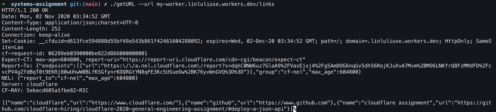
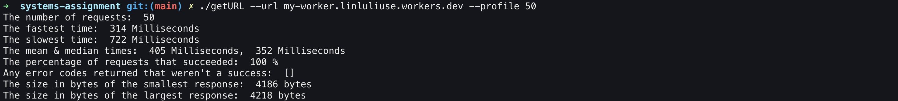
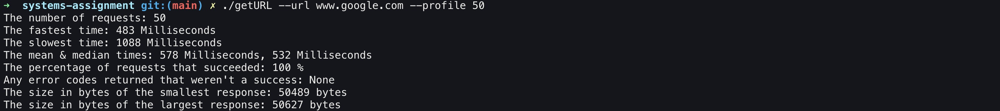
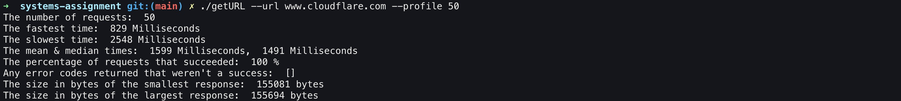

# getURL

## What is it?

This is a GO program that makes a request to the URL you provided using sockets directly instead of a library that handles the HTTP request.

## Instruction
### build
To create a binary executable file, use the following command line:
```
go build getURL.go
```
The above command will create a binary executable file `getURL` in the current directory, then you can execute it the following command line:
```
./ getURL --url <your_url>
```

## CLI tool
### help
```
./ getURL --help
```
It also allow a --help parameter that describes how to use it.

### Make a request to your link
```
./ getURL --url <URL>
```
It takes an required argument that is a full URL following `--url`.
It will make an HTTP request to the URL and print the response directly to the console.  


### Measure how fast it is
```
./ getURL --url <URL> --profile <N>
```
It also takes an argument --profile that takes a positive integer `N`.
It will make `N` requests to the provided URL, time the requests and then print the following results:

* The number of requests
* The fastest time
* The slowest time
* The mean & median times
* The percentage of requests that succeeded
* Any error codes returned that weren't a success
* The size in bytes of the smallest response
* The size in bytes of the largest response

## Results
Here are some screenshots of this tool run against my site and other websites.





Test your tool against your site and some other websites.  Let us know what you find in your readme.  Include outputs for popular sites and your own.  How do we compare?
