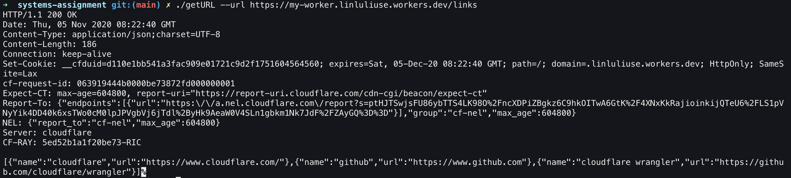
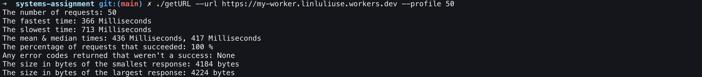

# getURL

## Instruction
This is a GO program that makes a request to the URL you provided using sockets directly instead of a library that handles the HTTP/HTTPS request.

### build
To create a binary executable file, use the following command line:
```
go build getURL.go
```
### run
The above command will create a binary executable file `getURL` in the current directory, then you can execute it the following command line:
```
./getURL --url <your_url>
```

## CLI tool

### Make a request to your link
```
./getURL --url <URL>
```
It takes an required argument that is a full URL following `--url`.
It will make an HTTP/HTTPS request to `URL` and print the response directly to the console.
If no protocal specified, by default, it will send an HTTPS request.


### Measure how fast it is
```
./getURL --url <URL> --profile <N>
```
`--profile` takes a positive integer `N`.
It will make `N` requests to the provided `URL`, time the requests and then print the following results:

* The number of requests
* The fastest time
* The slowest time
* The mean & median times
* The percentage of requests that succeeded
* Any error codes returned that weren't a success
* The size in bytes of the smallest response
* The size in bytes of the largest response

### help
```
./getURL --help
```
It allows a --help parameter that describes how to use it.

## Sample result
Here are some screenshots of this tool run against different websites.




